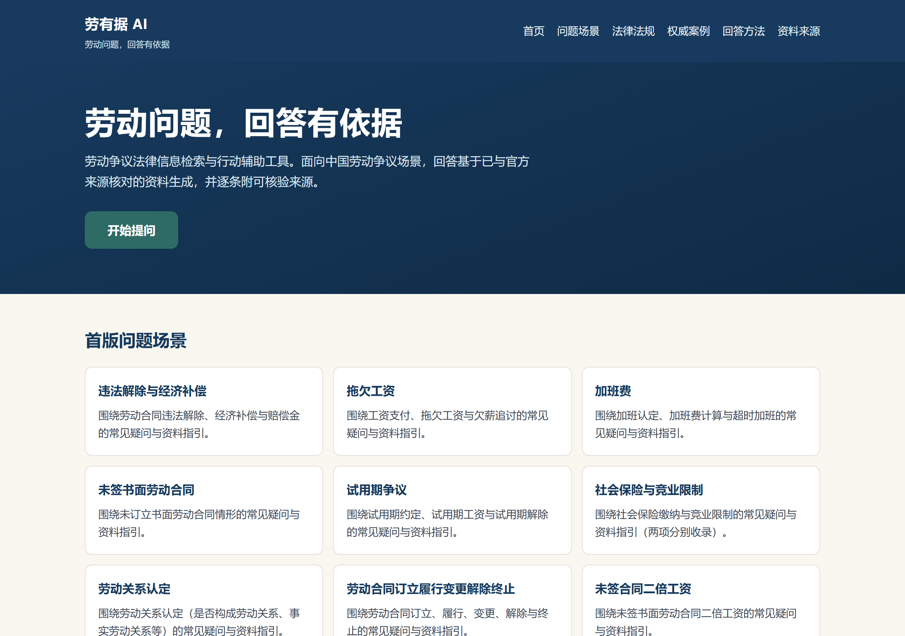
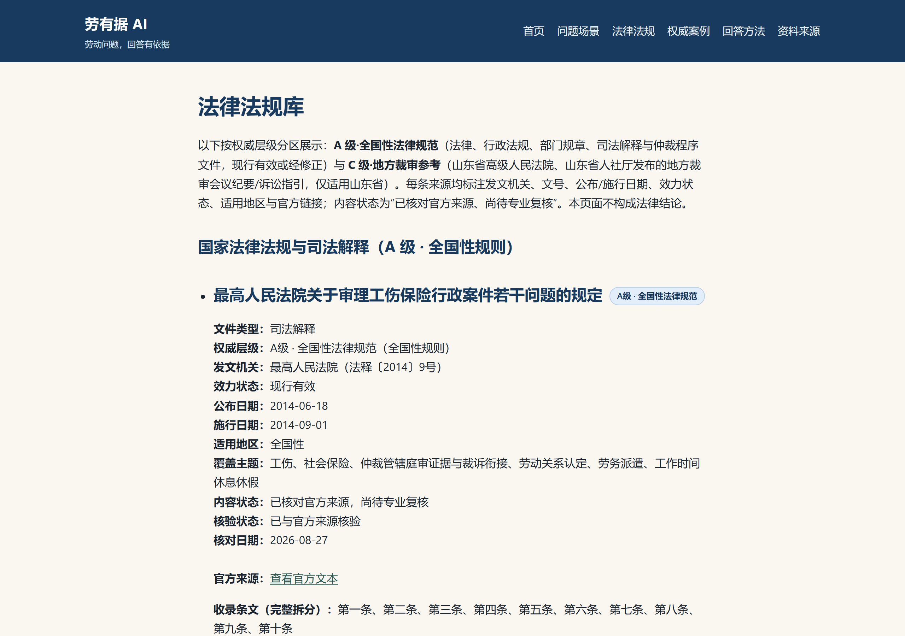
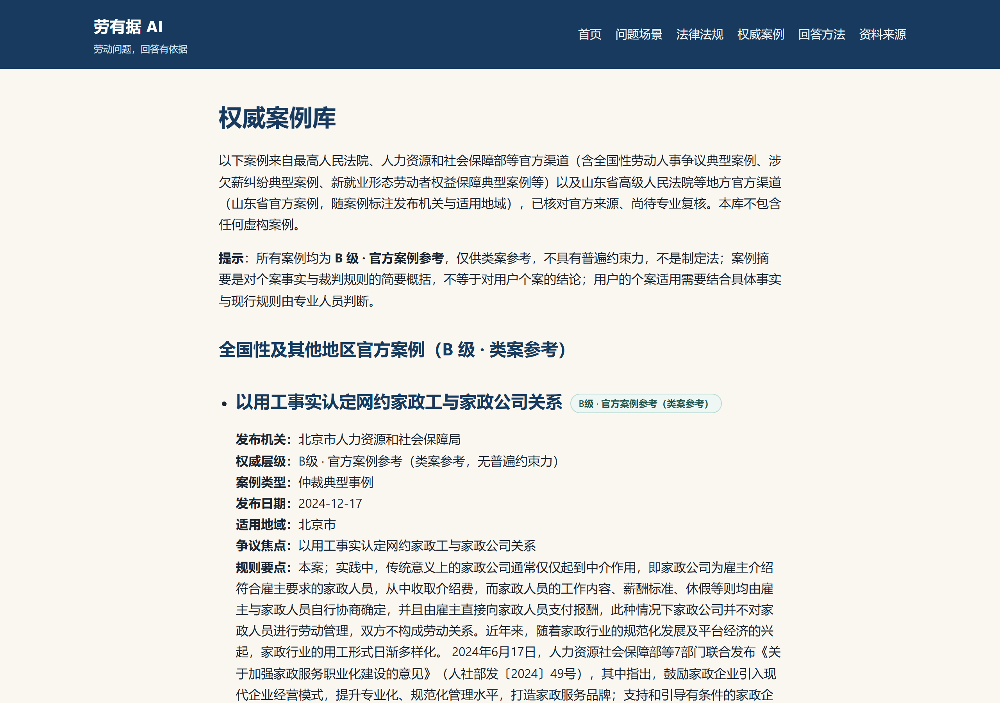
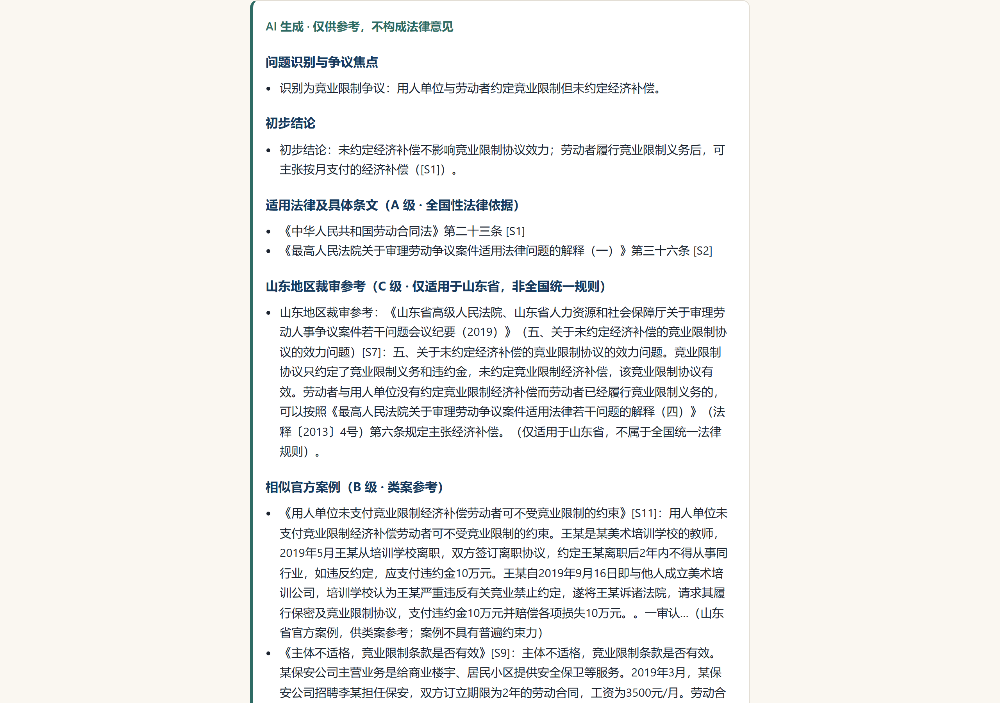

# 劳有据 AI

> 劳动问题，回答有依据。

劳有据 AI 是我做的一个劳动法规和案例检索项目。它会先从整理过的法规、官方案例和地方参考中查找相关材料，再由模型根据这些材料回答，并把引用来源一起列出来。

这个项目重点解决的是检索、证据分级和引用核对，而不是让模型脱离资料直接判断案件。

## 界面截图









以上均为本地服务生成的示例界面（问答页使用 Mock 模型，未调用线上真实模型），用于展示产品真实界面，不代表线上实时响应。

## 项目能做什么

- **劳动法规检索**：`/laws` 按「国家法律法规与司法解释」和「地方裁审参考（仅山东省）」分区展示 36 份规范，每份有效力状态、施行日期、覆盖主题与官方链接。
- **官方案例检索**：`/cases` 收录 219 个官方发布的劳动争议典型案例与指导性案例，标注发布机关、发布日期、适用地域；官方未公布案号的如实留空。
- **基于检索证据的问答**：`/ask` 依次做领域判断、检索、证据组织、模型生成与引用校验。三种结果：`answered`（给出完整回答）、`needs_clarification`（事实不足，给出法律框架、可能结论与需要补充的事实）、`out_of_scope`（非劳动问题，固定引导，不调用模型）。
- **来源追溯**：回答中每条依据都带引用编号、官方链接、条号、效力等级、适用地区与核验状态，可以在回答下方逐条展开核对。

## 项目如何工作

1. **领域判断**：先确定问题是否属于劳动争议。非劳动问题直接返回固定引导文案（不调用模型）；只有劳动类问题才进入检索与生成。
2. **BM25 检索**：中文 2/3-gram 加 BM25 的确定性本地索引（`packages/retrieval`，构建可复现、字节一致），配合话题过滤、关键词与同义词加权。
3. **来源分级（A/B/C）**：A 级全国性法律规范是法律结论的唯一依据；B 级官方案例只作类案参考；C 级地方裁审指引（目前为山东）只在问题涉及山东或地点未知时出现，并明确标注「仅适用于山东省，非全国统一规则」。
4. **DeepSeek 基于证据生成**：模型只能看到本次检索得到的证据白名单（[S1]…[Sn]），按八段结构输出回答，不引用证据之外的内容。
5. **引用校验**：模型引用的每一个编号必须能在证据集里找到；出现未知引用、或带「第 X 条」却没有有效引用支撑的结论段时，整段不保留，改为返回基于真实证据的澄清回答——不做「删除编号、留下未经支持的断言」。

## 数据范围

- 36 份法规与规范（34 份全国性 + 2 份山东地方裁审指引）
- 219 个官方案例
- 1308 条法规条文（已按条文拆分）
- 271 条来源登记（`content/sources/registry.json`：来源、官方 URL、分级、核验状态）
- BM25 索引约 1527 项（条文 + 案例，由内容库可复现构建）

所有内容均以官方来源核对（`source_verified`）；逐条来源清单见 [docs/CONTENT_REVIEW.md](docs/CONTENT_REVIEW.md)，案例主题覆盖与地区分布见 [docs/CASE_COVERAGE_AUDIT.md](docs/CASE_COVERAGE_AUDIT.md)。

## 技术实现

| 模块 | 说明 |
|---|---|
| `apps/web` | Next.js 16 静态导出；公开目录页可被搜索引擎收录，`/ask` 不参与收录 |
| `functions/api` | Node.js 原生 http + 原生 fetch 的 HTTP API（CloudBase 云函数与 VPS 单机两种形态）；唯一调用 DeepSeek 的入口 |
| `packages/shared` | 两端与后端共享的 API v1 契约（zod 运行时校验） |
| `packages/retrieval` | 内容 schema、加载、全局校验与中文 n-gram/BM25 检索 |
| `packages/search` | 联网搜索 provider（腾讯云 WSA；未配置 Key 时纯本地知识库工作） |
| 预算与保护 | SQLite 本地预算库（better-sqlite3，跨进程原子共享，损坏/不可用时模型调用安全失败）；客户端限流 6 次/分钟、30 次/天；全局模型 100 次/天、并发 3；kill switch；单次调用不重试、超时与输出上限 |

部署形态：`deploy/vps/`（Nginx 80 反代 + systemd + 专用用户 + 备份/回滚/健康检查/公网验证脚本），旧 CloudBase 部署方式保留在 [docs/DEPLOYMENT.md](docs/DEPLOYMENT.md)。

## 本地运行

要求 Node.js ≥ 20 且 < 25、pnpm（经 Corepack 启用）。

```bash
corepack pnpm install
corepack pnpm -r run build          # 构建 shared/retrieval/search/api/web
corepack pnpm run content:validate  # 校验内容库（laws=36 cases=219 provisions=1308 registry=271）
corepack pnpm run retrieval:build   # 重建 BM25 索引（content/.index/，生成物、不提交）
```

启动 API（未配置 Key 时也可运行：非劳动问题、澄清回答与本地检索可用；真实问答返回 503）：

```powershell
# PowerShell 示例（Bash 下改为 export）
$env:BUDGET_STORE = "sqlite"
$env:BUDGET_SQLITE_PATH = "<临时目录>\budget.sqlite3"
$env:HOST = "127.0.0.1"
$env:PORT = "9000"
$env:ALLOWED_ORIGINS = "http://localhost:3000"
$env:DEEPSEEK_API_KEY = "<你的 DeepSeek Key，可留空>"
node functions/api/dist/server.js
```

Web 端（Bash）：`NEXT_PUBLIC_API_BASE_URL=http://127.0.0.1:9000 corepack pnpm -C apps/web run dev`；PowerShell 下先设置 `$env:NEXT_PUBLIC_API_BASE_URL='http://127.0.0.1:9000'` 再运行。
也可以 `corepack pnpm -C apps/web run build` 静态导出后用任意静态服务器提供（`deploy/vps` 的 Nginx 配置可复用）。

完整门禁：`corepack pnpm run check`（lint + typecheck + 内容校验 + 索引重建 + 全部测试）。

## VPS 部署

单机部署手册见 [deploy/vps/README.md](deploy/vps/README.md)（安装、发布、备份、恢复、回滚、健康检查、公网验证与防火墙说明）；CloudBase 历史部署方式见 [docs/DEPLOYMENT.md](docs/DEPLOYMENT.md)。

## 使用边界

- 这是个人学习与求职展示项目，不是法律服务产品：不提供案件代理，回答不构成正式法律意见，也不对结果、胜诉率作任何承诺。
- 法律规范是结论依据；官方案例只是类案参考，个案情况不同，各地裁审口径可能存在差异；山东地方裁审指引仅适用于山东省，不是全国统一规则。
- 内容已完成与官方来源的核对（`source_verified`），但尚未经过执业律师的专业复核（仓库中没有 `legal_reviewed` 内容），请勿当作律师意见使用。
- 提问页面明确提示不要输入姓名、身份证号、手机号、公司商业秘密等敏感信息；服务端不记录问题原文，限制问题长度、调用频率与并发。

## 许可与内容来源

- 源代码采用 MIT License，见 [LICENSE](LICENSE)；许可范围与边界说明见 [NOTICE.md](NOTICE.md)。
- `content/` 下的法规、案例、官方资料及其他第三方内容**不在** MIT 许可范围内：其权利与使用条件以原发布机关、原始来源和适用规则为准，来源链接与结构化整理不代表对原文的再授权；未自行对任何法规、案例或第三方资料添加其他许可证。