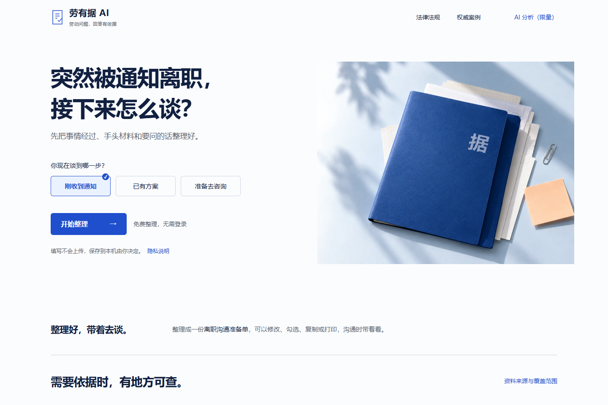
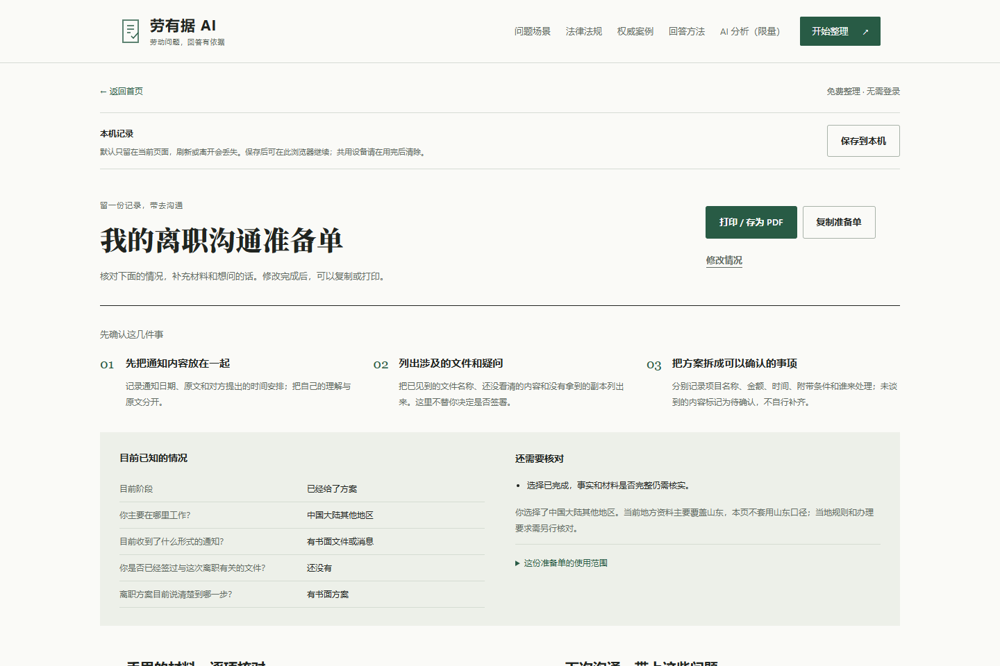
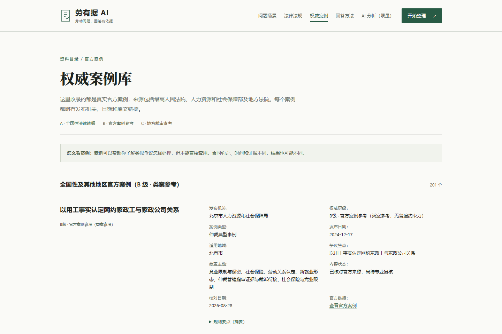
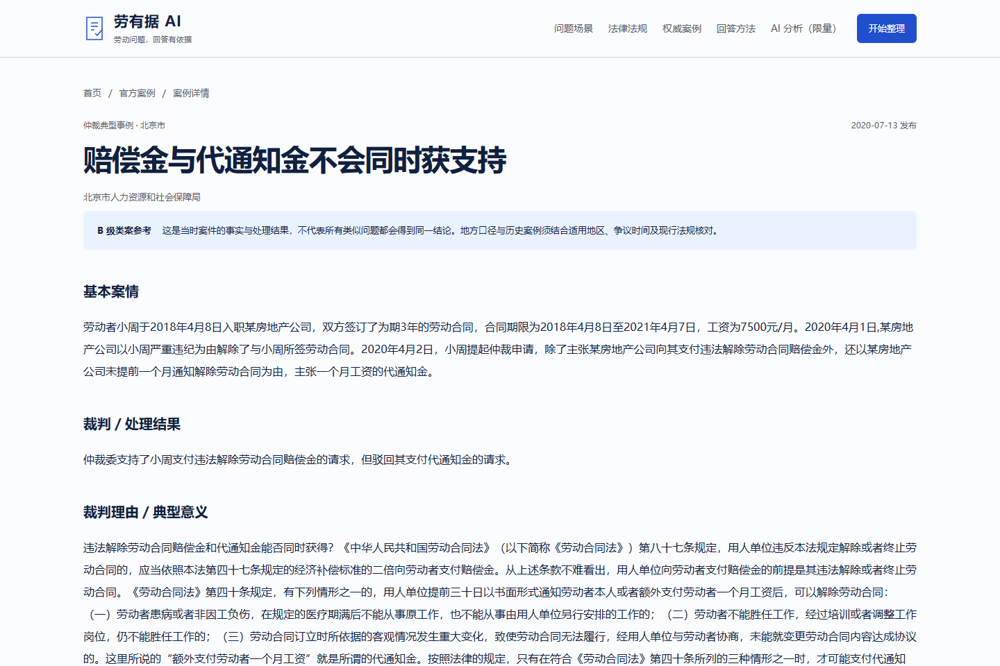
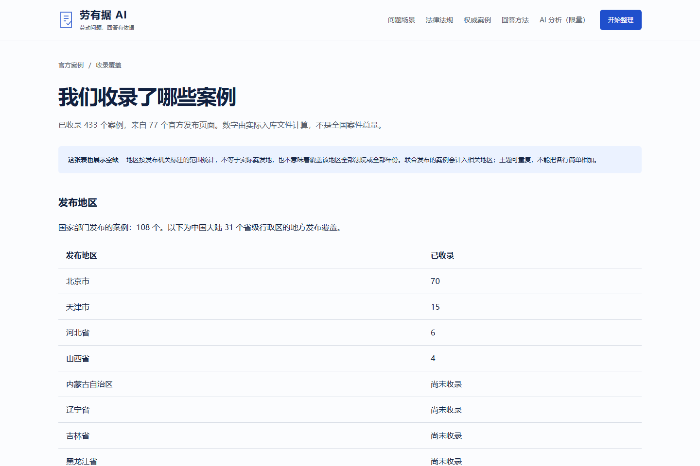
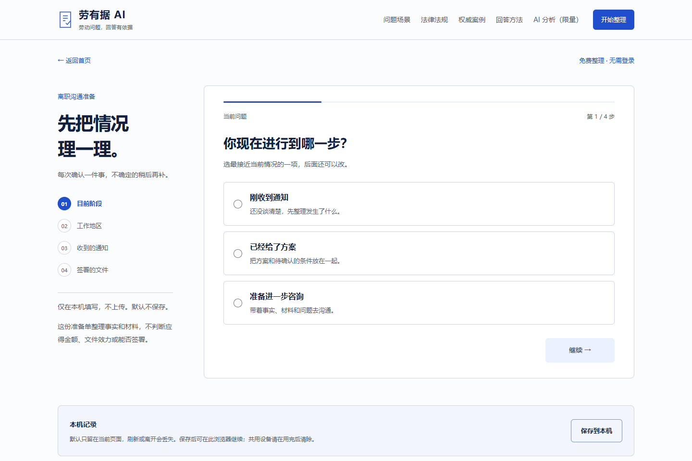
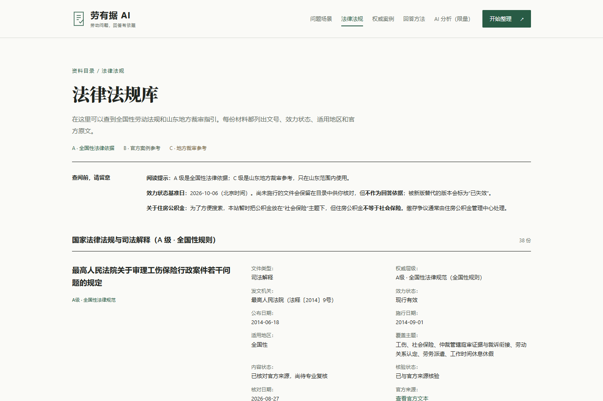
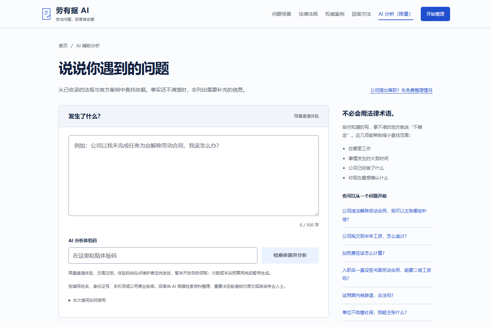

<p align="center">
  <a href="https://laoyoujuai.cn"></a>
</p>

<p align="center">
  面向中国劳动争议的开源助手。整理事实与材料，查阅官方资料，让 AI 回答有据可查。
</p>

<p align="center">
  <a href="https://laoyoujuai.cn/prepare/"><strong>免费整理离职准备单</strong></a> ·
  <a href="https://laoyoujuai.cn">访问网站</a> ·
  <a href="https://laoyoujuai.cn/cases/">官方案例库</a> ·
  <a href="#本地运行">本地运行</a> ·
  <a href="#文档">文档</a>
</p>

<p align="center">
  <a href="LICENSE"></a>
  <a href="apps/web/package.json"></a>
  <a href="docs/ARCHITECTURE.md"></a>
</p>

> **现在可以用什么？** 免费准备单、法规、案例和专题均已上线。2026-10-09 更新：案例库已收录 **433 篇官方案例**，支持组合筛选、分页与独立详情阅读。AI 分析在该日核验时仍暂停，免费流程不依赖模型或体验码。

<a href="https://laoyoujuai.cn">
  <picture>
    <source media="(max-width: 600px)" srcset="docs/images/screenshot-home-mobile.png" />
    
  </picture>
</a>

## 从一段经历，到一份准备单

公司提出离职时，先把经过、手头材料和要问的话整理好。选择「刚收到通知」「已有方案」或「准备去咨询」，回答少量问题，即可得到：

| 你会拿到 | 可以怎么用 |
| --- | --- |
| 事实与待确认事项 | 看清已经知道什么、下一次沟通还需要问什么 |
| 可勾选的材料清单 | 记录合同、通知、工资记录等材料是否在手、放在哪里 |
| 可编辑的沟通问题 | 按自己的情况调整，再复制或打印，带去沟通或咨询 |

**无需登录，不调用模型，填写不上传。** 默认只保留在当前页面；由你决定是否保存到本机，之后也可清除。准备单用于整理信息，不判断解除是否合法、文件效力或应得金额。



## 找到相关依据，读懂案例经过

官网可查阅 **95 份规范、3,481 条／项正文和 433 篇官方案例**。先按自己的问题缩小范围，再阅读条文、案例经过和处理理由，最后核对官方原文。

| 想做什么 | 现在可以怎样查 |
| --- | --- |
| 找常用法律依据 | 《劳动合同法》《劳动法》等常用依据置前，支持关键词、主题、范围和效力筛选 |
| 找相关案例 | 按关键词、发布地区、年份和主题组合筛选，切换重点优先或最新发布 |
| 阅读案例详情 | 每页 20 条，进入独立详情页查看案情、处理结果、理由和官方出处；关闭 JavaScript 也能翻页阅读 |
| 了解收录范围 | [收录覆盖页](https://laoyoujuai.cn/cases/coverage/) 展示地区、年份与主题分布，尚未收录的地区明确标出 |

<a href="https://laoyoujuai.cn/cases/">
  
</a>

<details>
<summary><strong>展开查看：案例详情、收录覆盖、法规和准备流程</strong></summary>

**案例详情** · 在独立页面阅读案情、处理结果与理由，并核对官方原文。



**收录覆盖** · 看清已收录什么、哪些地区仍待补充。



**免费准备流程** · 按阶段逐步整理，也可以返回修改。



**法律法规** · 查阅条文、效力与官方来源，区分全国规范和地方指引。



**AI 提问页** · 展示输入与能力边界；此图不代表真实生成已开放。



</details>

## 回答有依据，具体意味着什么

AI 问答先检索已核对官方来源的资料，再由服务端 DeepSeek 根据证据生成，最后校验引用和语义约束。线上真实生成采用限量体验，开放情况以 [AI 分析页](https://laoyoujuai.cn/ask/) 为准。

| 证据 | 在回答中的作用 | 明确的边界 |
| --- | --- | --- |
| **A · 全国性规范** | 支撑法律结论，定位到具体条文 | 检查效力和适用条件 |
| **B · 官方案例** | 提供主题与案情匹配的类案参考 | 案例不是普遍适用的法律规则 |
| **C · 地方指引** | 补充当地裁审口径 | 当前仅覆盖山东，不泛化为全国规则 |

每个 `source_id` 都须来自本次检索证据集，引用编号由程序逐条校验。事实缺失时给出待澄清问题；不存在有效依据时，明确说明 **“当前资料不足，无法可靠判断”**。引用校验能减少伪造来源，不能保证所有法律结论正确。

### 官网资料库

| 95 份规范 | 3,481 条／项正文 | 433 篇官方案例 | 544 条来源登记 |
| :---: | :---: | :---: | :---: |
| 93 份全国规范 + 2 份山东指引 | 按条文检索与引用 | 按主题和案情匹配 | 可追溯至官方来源 |

内容库统计于 **2026-10-09**，其中 94 份规范在该日有效；规范按文件及版本统计。案例较上一批新增 115 篇，共来自 77 个官方发布页面；地方发布范围涉及 19 个省区市，另有全国性发布。发布地区不等同于案发地，收录范围仍在扩充。

资料状态为「已核对官方来源，尚待专业法律复核」。部分历史案例为官方摘要或节选，具体收录范围以详情说明及官方原文为准。尚待核验的出处线索未计入案例数，也未进入 RAG；来源登记包含历史记录，不等于独立官方发布页面数。这不是全国法律或劳动争议案件的全量库。

可以直接查看 [法律法规](https://laoyoujuai.cn/laws/)、[官方案例](https://laoyoujuai.cn/cases/)、[案例收录覆盖](https://laoyoujuai.cn/cases/coverage/) 和 [来源说明](https://laoyoujuai.cn/about/sources/)。资料数量和引用校验不代表法律结论的准确率。

## 本地运行

需要 Node.js `>=20 <25` 和 Corepack；仓库固定使用 `pnpm@11.24.0`。

```bash
git clone https://github.com/Tiger1136/laoyouju-ai.git
cd laoyouju-ai
corepack pnpm install
corepack pnpm --filter @laoyouju/shared build
corepack pnpm --filter @laoyouju/retrieval build
corepack pnpm run content:validate
corepack pnpm --filter @laoyouju/web dev
```

打开 [localhost:3000](http://localhost:3000)，启动本仓库的 Web 开发环境。本地资料浏览不需要模型 Key；上述步骤不启动问答 API。服务端配置与单机部署见 [VPS 手册](deploy/vps/README.md)，Key 仅放在服务端环境变量中。

上方截图和功能介绍对应官网版本；本地可用功能以仓库当前提交为准。

<details>
<summary><strong>项目结构与验证命令</strong></summary>

```text
apps/web/             网页、资料目录与问答界面
functions/api/        分流、生成、引用校验与费用控制
packages/retrieval/   内容 Schema、BM25 索引与目录生成
packages/search/      检索编排与证据选择
packages/shared/      前后端共享契约
content/              已核对官方来源的法规、案例与来源登记
deploy/vps/           Nginx、systemd、发布与回滚
```

```bash
corepack pnpm -r run build
corepack pnpm run check
```

当前主部署为腾讯云轻量服务器：Nginx 提供静态页面并反向代理仅监听回环的 Node API，SQLite 持久化费用账本。公开资料静态生成，私人问答与准备流程不参与搜索索引。CloudBase 保留为旧演示与回退方案；微信小程序尚未完成。

</details>

## 文档

| 想了解什么 | 从这里开始 |
| --- | --- |
| 回答怎样形成、来源如何分级 | [回答方法](https://laoyoujuai.cn/about/methodology/) · [内容复核](docs/CONTENT_REVIEW.md) |
| 资料来源与覆盖范围 | [官网资料说明](https://laoyoujuai.cn/about/sources/) · [案例收录覆盖](https://laoyoujuai.cn/cases/coverage/) |
| 本地架构、部署与费用控制 | [架构](docs/ARCHITECTURE.md) · [VPS 部署](deploy/vps/README.md) |
| 安全与隐私 | [安全说明](docs/SECURITY.md) · [网站隐私说明](https://laoyoujuai.cn/privacy/) |
| 项目记录 | [进度](docs/PROGRESS.md) · [决策记录](docs/DECISIONS.md) |

欢迎通过 [Issues](https://github.com/Tiger1136/laoyouju-ai/issues) 反馈页面问题或提供可核对的官方来源。请勿在公开 Issue 中提交身份证号、联系方式、劳动合同或其他个人敏感信息。

## 许可与使用边界

这是一个个人开源项目，用于查阅资料和整理问题，不替代专业法律意见。涉及大额争议、临近时效或准备仲裁诉讼时，请让专业人士结合完整事实核对。

源代码与原创部署配置采用 [MIT License](LICENSE)。`content/` 中的法规、案例及官方资料不属于 MIT 授权范围，来源、权利边界与复核状态见 [NOTICE.md](NOTICE.md)。
